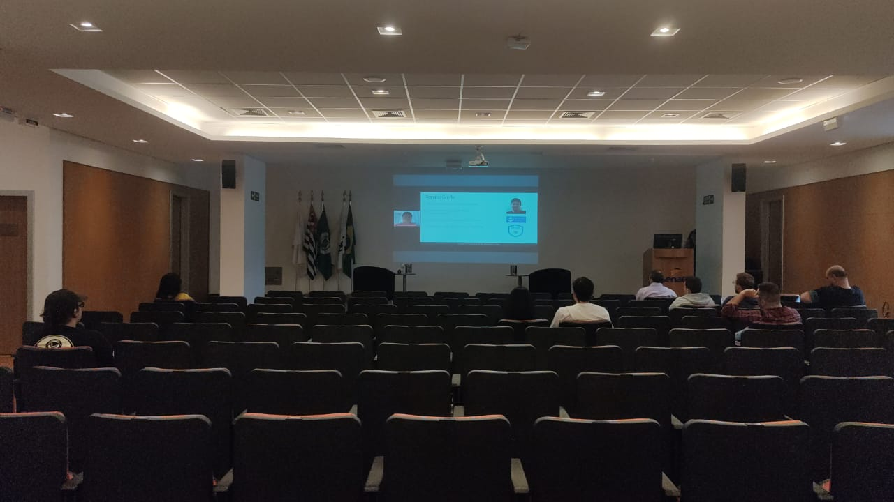
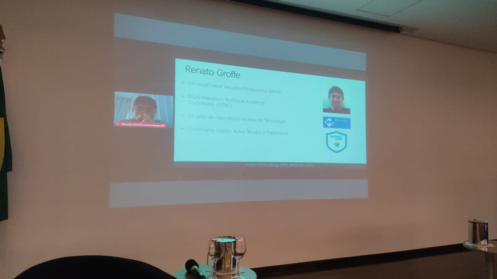
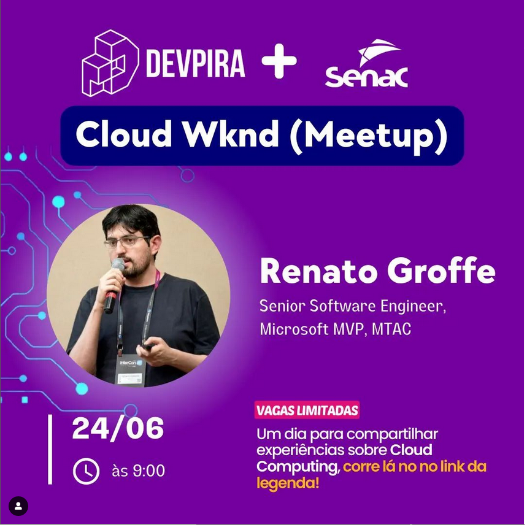
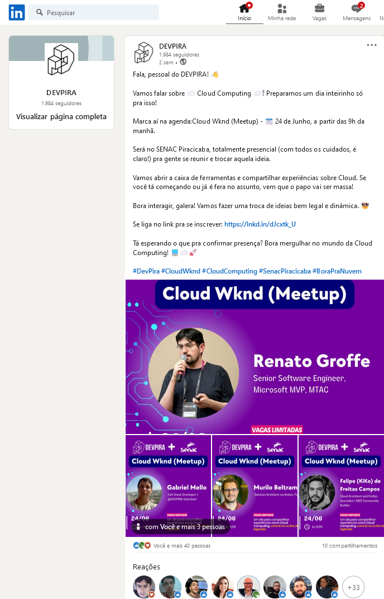

# KEDA_CloudWeekend-Jun2023

Informações (dados gerais + prints) + slides sobre a apresentação que realizei durante o **Cloud Wknd (Meetup)**, um evento realizado na cidade de **Piracicaba-SP** no dia **24/06/2023**.

Título da Apresentação: **Kubernetes, Escalabilidade e KEDA - Criando aplicações para processar milhares (ou milhões) de acessos simultâneos!**

Na pasta [**/src**](src/) está um exemplo de uso do [**KEDA (Kubernetes Event-driven Autoscaling)**](https://keda.sh/) utilizando **Cron Scaler**.

Tecnologias utilizadas: **Kubernetes, Azure Kubernetes Service, KEDA, Docker, Docker Hub, .NET 7, ASP.NET Core, k9s, Linux**

Número de participantes: **10 pessoas**

Local: **Senac Piracicaba - Rua Santa Cruz, 1148 Alto - Piracicaba - SP**

Formulário utilizado para inscrições: [**Sympla**](https://www.sympla.com.br/evento/devpira-cloud-wknd/2027362)

Redes sociais: [**LinkedIn**](https://www.linkedin.com/feed/update/urn%3Ali%3Aactivity%3A7077074008021639168/) | [**Instagram**](https://www.instagram.com/p/Ctu31jyOa0t/)

Deixo aqui meus agradecimentos ao **Murilo Beltrame**, ao **Alexandre Ballestero**, ao **Fábio Baldin** e ao **Gabriel Mello** por todo o apoio para que eu partipasse como palestrante do **Cloud Wknd (Meetup)**.

Minha participação no evento foi remota, já que estava em São Paulo-SP no momento em que realizei a palestra.

---

